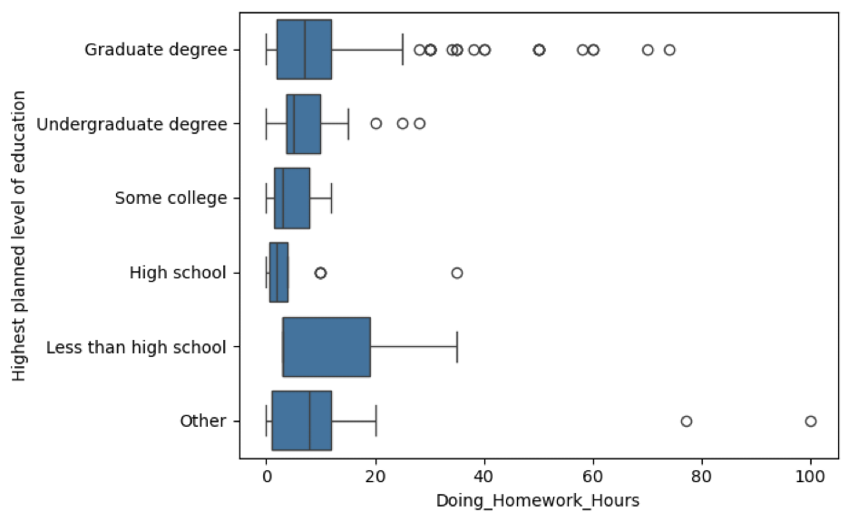
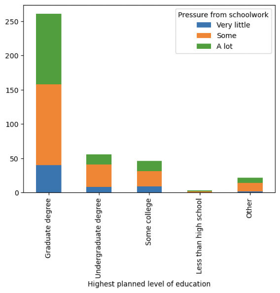

# Static Visualization Report

Oskar Blyt

## Research question

I will use the responses from the following questions from the Census
questionnaire:

-   Q33: Estimate how many hours a week you usually spend doing homework?
-   Q34: How much pressure do you feel because of the schoolwork you have to
    do?
-   Q35: What is the highest level of education you plan to attain?

To investigate the following questions:

How does the pressure of schoolwork (Q34) relate to the highest level of
education planned to be attained (Q35)? How do they change with the amount of
time spent doing homework each week (Q33)?

## Exploring the data

::: {#f1 layout-ncol="2"}
{#fig-box width="7cm"}

{#fig-bar width="5cm"}
:::

In a stacked bar chart, the bar heights would show the variation in the number of students
planning for a particular education level and colour would indicate how the level of pressure is distributed within each group of
students. Note that this makes it more difficult to compare the proportions of pressure
levels across groups since their total heights vary.

Providing time estimates may be prone to errors and biases shown by the outliers in @fig-box. A way to mitigate these could be to split the students into quantiles based on homework hours.

The three variables could be shown in a single visualization by utilizing small multiples: each multiple is for a students with the same planned education level and shows a stacked bar chart similar to @fig-bar where the x-axis is now ordinal by using homework hour quartiles.

## Design iterations

### V1

Size of bars shows the number of students within a particular quartile and planned education level. Density accurately shows the levels of pressure, which is ordinal, within each group. The visual allows for clear comparisons between planned education levels such as those in Q4 between graduate degree and high school. Next iteration:

  - Rename the x-axis groups to something more descriptive such as the bounds of the quartiles “<X hours per week” or “between X-Y hours”
  - Switch to color to increase visual interest

### V2

Adding ranges for the different study time groups adds information about how students are distributed within each group. The labels help for analyzing a single plot: ex: about an equal number of students who study less than 2 hours and who study at least 12 hours per week who aim for a graduate degree. Next iteration:

-  Instead of plotting number of students, use percentage of students in each group. This would allow for easier between group comparisons by unifying the y-axis scale. Include the group size somewhere so that the information is not lost.

### V3

Since within-plot groups are split into quartiles, they should in theory have the same height but because of many duplicate values in the data, The bins end up containing unequal numbers of samples. Next iteration:

- Attempt to use pooled quartiles to unify the x-axes which would aid in comparing the distributions of homework hours across groups. Some bins may end up with no samples because the groups have different distributions.

### V4

All groups have samples in all bins using applying pooled quartiles. Now all axes are unified which makes comparisons across plots much easier. Next iteration:

- To increase the data to ink ratio, remove some of the axes tick labels where it can be inferred from neighboring plots. The legend and title, and axis labels could be make a bit larger to differentiate them from the axes tick labels.


```{=latex}
\begin{tabular}{m{8cm} m{10cm}}
\includegraphics[width=8cm]{images/v1.png} & \textbf{V1:}
Size of bars shows the number of students within a particular quartile and planned education level. The density shows the levels of pressure (which is ordinal) within each group. It is clear for making comparisons between plots such as those in Q4 between graduate degree and high school. You can see a higher proportion of students with a lot of pressure in the graduate group.

Improvements to be made:
\begin{itemize}
  \item Remove redundant x-axis labels
  \item Rename the x-axis groups to something more descriptive such as the bounds of the quartiles “<X hours per week” or “between A-B hours”
  \item Switch to color to increase visual interest
\end{itemize} \\

\includegraphics[width=8cm]{images/v2.png} & \textbf{V2:}
Adding ranges for the different study time groups adds information about how students are distributed within each group. The labels help for analyzing a single plot: ex: about an equal number of students who study less than 2 hours and who study at least 12 hours per week who aim for a graduate degree. 
Improvements to be made:
\begin{itemize}
  \item Between plot comparisons are more difficult since the labels vary because they have been produced using quantiles. One approach would be to unify the bins across plots. This may lead to very few observations in some bins depending on how the bin edges are chosen.
  \item Instead of plotting number of students, use percentage of students in each group. This would allow for easier between group comparisons by unifying the y-axis scale. Include the group size somewhere.

\end{itemize} \\

\includegraphics[width=8cm]{images/v2.png} & \textbf{V3:}
Since within-plot groups are split into quartiles, they should in theory have the same height but because of many duplicate values in the data, The bins end up containing unequal numbers of samples. 

Improvements to be made:
\begin{itemize}
  \item Attempt to use pooled quartiles to unify the x-axes which would aid in comparing the distributions of homework hours across groups. Some bins may end up with no samples because the groups have different distributions.
\end{itemize} \\
\end{tabular}
```
